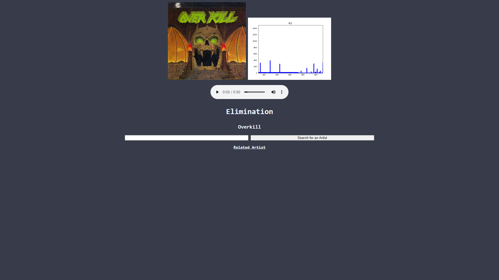

# CitrusHack2019SpotifyController

A web app designed to show recommendations of similar artists based on genre, tempo, and style of music

## Overview

Utilizes Fast Fourier Transforms to analyze waveforms to display an audio visualizer. Completed over the course of 36 hours for Citrus Hack 2019.

## Built With

- HTML
- CSS
- Python
- Spotify API
- Flask
